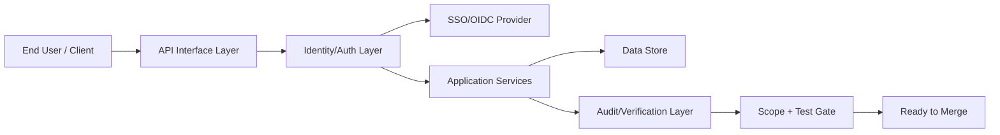

# I wanna build an authentication system - Architecture

## Architecture Intent
I wanna build an authentication system I wanna build it for a web application and also provide api Web would be use a pre built framework as needed and for API exposing some of the things as needed What do you think? You suggest once Oauth and social logins yeah

## In-Scope Components
- Break work into small implementation tasks
- Implement core requirements from the agreed direction
- Add verification for completed behavior

## File Boundaries
- `src/**`

## Layered Design
| Layer | Responsibility |
|---|---|
| Interface Layer | Client/API surface, input validation, request routing |
| Identity Layer | Authentication/session handling and policy checks |
| Application Layer | Feature orchestration and business rules |
| Data Layer | Persistent user/auth state and audit-related records |
| Verification Layer | Test and drift checks before completion/merge |

## Integration Points
- Auth library/framework configured as single source of truth for identity.
- External SSO/OIDC provider handles federated identity assertions.
- MFA is optional/not explicitly required in current scope.
- Lightweight state handling is acceptable unless persistence requirements expand.

## Data Contracts
- Auth/User model: user id, identity claims, status flags, role/permission references.
- Session/Token model: issued-at, expiry, revocation state, audience/scope.
- MFA model: reserved for future extension.
- Audit model: actor, action, target resource, timestamp, result.

## Request-to-Delivery Flow
1. Client calls protected endpoint through API/interface layer.
2. Identity layer validates session/token and loads user context.
3. If federated login is used, identity claims are verified against SSO/OIDC provider.
4. Access policy checks continue without mandatory MFA branch.
5. Application layer executes business logic and persists required state.
6. Audit/verification pipeline validates behavior and scope compliance before completion.

## Risks and Guardrails
- Drift risk: enforce file boundaries during implementation and diff audit.
- Security risk: reject weak token/session handling and missing negative-path tests.
- Delivery risk: map each story/subtask to acceptance criteria to avoid orphaned changes.
- Integration risk: handle provider downtime/claim mismatch fallback paths.

## Diagram

---
Generated: 2026-02-21T08:02:21.535Z
