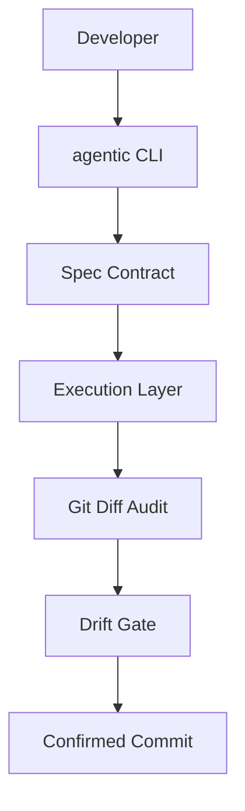

# Agreed Approach: Build an authentication system for a web application... - Architecture

## In-Scope Components
- Break work into small implementation tasks
- Implement core requirements from the agreed direction
- Add verification for completed behavior

## File Boundaries
- `src/**`

## Diagram

---
Generated: 2026-02-21T07:47:30.878Z
