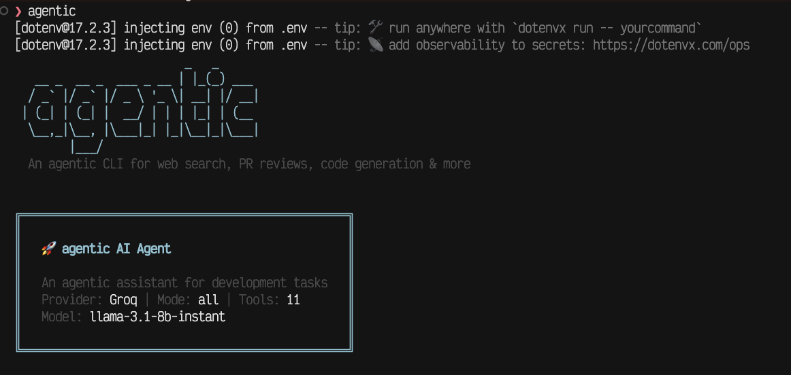

# agentic CLI

<div align="center">
  
</div>

An agentic CLI tool powered by Vercel AI SDK and AI Gateway that combines web search, PR reviews, code generation, and command execution into an intelligent development assistant. Access 100+ AI models from OpenAI, Anthropic, Google, xAI, and more through a single API key. There can be some errors. If you find any please report them in the issues in Github.

## Features

- **🔍 Web Search** - Search the internet using Exa AI for documentation, code examples, and solutions
- **📋 PR Reviews** - Fetch, analyze, and review GitHub Pull Requests with AI assistance
- **💻 Code Generation** - Generate complete code files and project structures
- **⚡ Command Execution** - Run shell commands and get AI help fixing errors
- **🤖 Agentic Workflow** - Multi-step tool calling for complex tasks
- **📋 Spec-Driven Development** - Create plans, verify changes, and execute with AI assistance
- **🔧 Skills System** - Extend capabilities with installable skills from skills.sh

## Quick Setup

```bash
# 1. Install dependencies
bun install

# 2. Configure API keys (interactive wizard)
bun run setup

# 3. Test it works
bunx agentic-cli ask "Hello, world!"
# or: bun run src/main.js ask "Hello, world!"

# 4. (Optional) Create an alias for easier use
echo 'alias agentic="bunx agentic-cli"' >> ~/.zshrc
source ~/.zshrc
```

**📖 For usage instructions, see [USAGE.md](./USAGE.md)**

**📖 For detailed setup instructions, see [SETUP.md](./SETUP.md)**

## Installation

```bash
# Install dependencies
bun install

# Link the CLI globally (optional)
bun link
```

## Setup

### 1. Select Your AI Provider

Choose which AI provider you want to use:

```bash
# Interactive provider selection
agentic config provider set

# Or set directly
agentic config provider set openai
agentic config provider set anthropic
agentic config provider set google
agentic config provider set groq
agentic config provider set mistral
agentic config provider set xai
agentic config provider set openrouter
agentic config provider set gateway  # Vercel AI Gateway (default)
```

**Available Providers:**
- **Vercel AI Gateway** (default) - Access 100+ models with a single API key
- **OpenAI** - GPT-5, GPT-4, O-series models
- **Anthropic** - Claude Opus, Sonnet, Haiku models
- **Google Generative AI** - Gemini 2.5, 3.0, Imagen models
- **Groq** - Fast inference for Llama, Mixtral, Gemma models
- **Mistral AI** - Mistral Large, Medium, Small models
- **xAI Grok** - Grok 4, Grok 3, Grok 2 models
- **OpenRouter** - Unified API access to models across providers with one key

### 2. Configure API Keys

```bash
# Interactive setup wizard (configures provider + API keys)
bun run setup
# or
agentic config setup

# Or set individual keys
agentic config set OPENAI_API_KEY your_key_here
agentic config set ANTHROPIC_API_KEY your_key_here
agentic config set GROQ_API_KEY your_key_here
# etc.

# Initialize .env file with template
agentic config init-env

# Show required environment variables
agentic config env

# List all configured keys
agentic config list

# Remove a key
agentic config remove OPENAI_API_KEY

# Show config file paths
agentic config path
```

### Required API Keys

The API key you need depends on your selected provider:

| Provider | API Key Name | Get it from |
|----------|--------------|-------------|
| Vercel AI Gateway | `AI_GATEWAY_API_KEY` | [Vercel AI Gateway](https://vercel.com/ai-gateway) |
| OpenAI | `OPENAI_API_KEY` | [OpenAI Platform](https://platform.openai.com/api-keys) |
| Anthropic | `ANTHROPIC_API_KEY` | [Anthropic Console](https://console.anthropic.com/settings/keys) |
| Google | `GOOGLE_GENERATIVE_AI_API_KEY` | [Google AI Studio](https://aistudio.google.com/apikey) |
| Groq | `GROQ_API_KEY` | [Groq Console](https://console.groq.com/keys) |
| Mistral | `MISTRAL_API_KEY` | [Mistral Console](https://console.mistral.ai/api-keys) |
| xAI | `XAI_API_KEY` | [xAI Console](https://console.x.ai/api-keys) |
| OpenRouter | `OPENROUTER_API_KEY` | [OpenRouter Keys](https://openrouter.ai/keys) |

**Optional Keys:**
- `EXA_API_KEY` - For web search functionality ([Exa AI](https://exa.ai))
- `GITHUB_TOKEN` - For PR review functionality ([GitHub Settings](https://github.com/settings/tokens))

### 3. Install Provider Packages (Automatic)

The CLI will **automatically install** provider packages when you select a provider! 

When you run `agentic config provider set <provider>`, the CLI will:
1. Check if the provider package is installed
2. Prompt you to install it if missing
3. Automatically run `bun add <package>@latest` for you (installs v2.0.0+ for AI SDK 5 compatibility)

**Manual Installation (if needed):**

If automatic installation fails, you can install manually. **Important:** For AI SDK 5 compatibility, you need version 2.0.0 or later:

```bash
bun add @ai-sdk/openai@latest      # For OpenAI (v2.0.0+)
bun add @ai-sdk/anthropic@latest  # For Anthropic (v2.0.0+)
bun add @ai-sdk/google@latest      # For Google (v2.0.0+)
bun add @ai-sdk/groq@latest        # For Groq (v2.0.0+)
bun add @ai-sdk/mistral@latest     # For Mistral (v2.0.0+)
bun add @ai-sdk/xai@latest         # For xAI (v2.0.0+)
bun add @openrouter/ai-sdk-provider@latest  # For OpenRouter
```

**AI SDK 5 Compatibility:**
- AI SDK 5 requires all `@ai-sdk/*` provider packages to be version **2.0.0 or later**
- These versions implement the v2 specification required by AI SDK 5
- If you see an error like "Unsupported model version v1", update your provider packages:
  ```bash
  # Update all provider packages to v2.0.0+
  bun add @ai-sdk/groq@latest @ai-sdk/openai@latest @ai-sdk/anthropic@latest @ai-sdk/google@latest @ai-sdk/mistral@latest @ai-sdk/xai@latest
  ```
- The CLI automatically installs `@latest` versions when setting up providers, ensuring AI SDK 5 compatibility

**Note:** 
- Vercel AI Gateway is built into the AI SDK and doesn't require a separate package
- Packages are also automatically installed when you first use a provider (if missing)

### Provider Management

```bash
# List all available providers with status
agentic config provider list

# Show current provider details
agentic config provider current

# Set provider interactively (shows selection menu)
agentic config provider set

# Set provider directly
agentic config provider set openai
agentic config provider set anthropic
agentic config provider set groq
agentic config provider set openrouter
agentic config provider set gateway
```

### Model Management

The available models depend on your selected provider:

**Vercel AI Gateway** (default) - 100+ models from multiple providers:

```bash
# List all available models for current provider
agentic model list

# Set a model interactively (shows a select menu)
agentic model set
# For Gateway provider, you'll get options:
# - Option 1: Browse all 100+ models in one menu
# - Option 2: Filter by provider first, then select model

# Set a specific model directly
agentic model set openai/gpt-5-mini
agentic model set anthropic/claude-sonnet-4.5
# For OpenRouter or custom IDs, unknown IDs are added automatically as custom models
agentic model set z-ai/glm-4.5-air:free

# Show current model
agentic model current
# or
agentic model show
```

**Provider-Specific Models:**

For direct providers (not Gateway), models don't have the provider prefix:

```bash
# OpenAI provider
agentic model set gpt-5-mini
agentic model set gpt-5
agentic model set o3

# Anthropic provider
agentic model set claude-sonnet-4.5
agentic model set claude-opus-4.5

# Groq provider
agentic model set llama-3.3-70b-versatile
agentic model set mixtral-8x7b-32768
```

**Interactive Model Selection:**
When you run `agentic model set` without arguments, you'll see an interactive menu:
- **For Gateway provider**: 
  - Option to browse all 100+ models in one scrollable menu
  - Option to filter by provider first, then select model
- **For direct providers**: Shows only that provider's models

The current model is marked with a ✓ checkmark in the menu.

**Custom Models:**

Add and manage custom models for any provider:

```bash
# Add a custom model
agentic model add <model-id> <model-name> <provider>
agentic model add "groq/llama-4-test" "Llama 4 Test" groq

# List custom models
agentic model custom

# Set a custom model as active
agentic model set groq/llama-4-test

# Remove a custom model
agentic model remove groq/llama-4-test
```

**Model Switching:**

Switch models while preserving session context:

```bash
# Switch model interactively
agentic model switch

# Switch to a specific model
agentic model switch claude-sonnet-4.5
```

**Popular Models (Gateway):**
- `openai/gpt-5-mini` - Fast and efficient (default)
- `openai/gpt-5` - More capable
- `anthropic/claude-sonnet-4.5` - Excellent reasoning
- `google/gemini-2.5-flash` - Fast and versatile
- `xai/grok-4` - Powerful reasoning

**Provider-Specific Models:**
- **OpenAI**: `gpt-5-mini`, `gpt-5`, `gpt-4o`, `o3`, `o3-mini`
- **Anthropic**: `claude-sonnet-4.5`, `claude-opus-4.5`, `claude-haiku-4.5`
- **Google**: `gemini-2.5-flash`, `gemini-2.5-pro`, `gemini-3-pro-preview`
- **Groq**: `llama-3.3-70b-versatile`, `mixtral-8x7b-32768`, `qwen/qwen3-32b`
- **Mistral**: `mistral-large-latest`, `mistral-medium-latest`, `pixtral-large-latest`
- **xAI**: `grok-4`, `grok-3`, `grok-3-fast`
- **OpenRouter**: `anthropic/claude-3.5-sonnet`, `meta-llama/llama-3.1-405b-instruct`, `openai/gpt-4o-mini`

Set a default model via environment variable:
```bash
export AGENTICAI_MODEL=gpt-5-mini  # For OpenAI provider
export AGENTICAI_MODEL=openai/gpt-5-mini  # For Gateway provider
```

## Usage

### Interactive Chat

Start an interactive session with all tools available:

```bash
agentic
# or
agentic chat
```

Continue a previous session:

```bash
# Continue a session
agentic -s <session-id>
agentic chat -s <session-id>
```

### Quick Commands

```bash
# Search the web
agentic search "React 19 new features"

# Ask a single question
agentic ask "How do I set up TypeScript in a Bun project?"

# Ask with specific tool mode
agentic ask "What is React?" --mode search

# Review a PR
agentic review https://github.com/owner/repo/pull/123

# Review and post comment to PR
agentic review https://github.com/owner/repo/pull/123 --post

# Review current branch (if in git repo)
agentic review

# Generate code
agentic generate "a REST API with Express and TypeScript"

# Run a command and fix errors
agentic run "npm test"

# Fix issues in a file
agentic fix src/index.ts

# Fix specific error
agentic fix src/index.ts --error "Cannot find module"

# Fix issues in current project
agentic fix
```

### Spec-Driven Development (Plan Mode)

Create, verify, and execute implementation plans:

```bash
# List all plans
agentic plan list

# Create a new plan interactively
agentic plan create

# Create a plan from an AI prompt
agentic plan create -a "Add user authentication with JWT"

# Show plan details
agentic plan show <plan-id>

# Activate a plan for verification
agentic plan activate <plan-id>

# Check current plan status
agentic plan status

# Verify changes against active plan
agentic plan verify

# Verify with AI analysis
agentic plan verify --ai

# Execute a plan (asks for confirmation before changes)
agentic plan run <plan-id>

# Execute with strict drift blocking (default)
agentic plan run <plan-id> --strict

# Execute with warnings only (no block)
agentic plan run <plan-id> --no-strict

# Use AI-enhanced audit after execution
agentic plan run <plan-id> --audit-ai

# Execute active plan
agentic plan run

# Create and execute plan from AI prompt
agentic plan run -a "Create a utility function for date formatting"

# Interactive planning session (chat with AI to plan together)
agentic plan run -i

# Add a phase to a plan
agentic plan phase add <plan-id>

# Delete a plan
agentic plan delete <plan-id>
```

**Export Plans:**

```bash
# Export as Markdown
agentic plan export markdown <plan-id>
agentic plan export md <plan-id> -o plan.md

# Export as JSON
agentic plan export json <plan-id> -o plan.json
```

**Generate Tickets from Plans:**

```bash
# Export as GitHub Issues format
agentic plan ticket github <plan-id>

# Export as Jira format
agentic plan ticket jira <plan-id>

# Export as task list
agentic plan ticket tasks <plan-id>
```

### Interactive Planning Session

Start a collaborative planning session with the AI:

```bash
agentic plan run -i
```

This enters an interactive mode where you can:
- Co-plan with the AI through clear checkpoints: Discovery, Approach, Technology, Agreement
- Use `status` or `/plan-status` to see live collaboration progress
- Use `recap` or `/plan-recap` to summarize decisions and open questions
- Say "create plan" or "let's do it" to generate a formal plan
- Review and approve the plan before implementation

### Skills Management

Extend capabilities with installable skills:

```bash
# List installed skills
agentic skills list

# Show skill instructions
agentic skills show <skill-name>

# Add a skill from skills.sh or GitHub
agentic skills add <repo>
agentic skills add vercel-labs/agent-skills@vercel-react-best-practices
```

### Session Management

Manage chat sessions:

```bash
# List all sessions
agentic sessions --list

# Delete a session
agentic sessions --delete <session-id>
```

### Preferences

Customize AI personality:

```bash
# Show current preferences
agentic preferences --show

# List available personalities
agentic preferences --list-personalities

# Set personality
agentic preferences --personality friendly
```

**Available Personalities:**
- `calm` - Peaceful, patient, and measured responses
- `senior` - Experienced mentor with high standards
- `friendly` - Warm, approachable, and encouraging
- `concise` - Brief, to-the-point responses
- `professional` - Business-appropriate, formal responses
- `mentor` - Educational focus with teaching approach

### Tool Modes

You can limit which tools are available for chat and ask commands:

```bash
# Only search tools (webSearch, getContents)
agentic chat --mode search
agentic ask "Search for..." --mode search

# Only code/file tools (readFile, writeFile, executeCommand, etc.)
agentic chat --mode code
agentic ask "Create a file..." --mode code

# Only PR review tools (getPRInfo, postPRComment, getGitStatus)
agentic chat --mode pr-review
agentic ask "Review this PR..." --mode pr-review

# All tools (default)
agentic chat --mode all
agentic ask "Help me..." --mode all
```

**Tool Modes:**
- `all` - All available tools (default)
- `search` - Web search tools only
- `code` - File and code manipulation tools only
- `pr-review` - GitHub PR review tools only

## Commands Reference

### Main Commands

| Command | Description | Options |
|---------|-------------|---------|
| `agentic` | Start interactive chat (default action) | `-s, --session <id>` - Continue session |
| `agentic chat` | Start interactive AI agent chat session | `-m, --mode <mode>` - Tool mode: `all`, `search`, `code`, `pr-review` (default: `all`)<br>`-s, --session <id>` - Continue session |
| `agentic search <query...>` | Search the web using Exa AI | - |
| `agentic ask <question...>` | Ask a single question (non-interactive) | `-m, --mode <mode>` - Tool mode |
| `agentic review [pr-url]` | Review a GitHub Pull Request | `--post` - Post the review as a comment on the PR |
| `agentic generate <description...>` | Generate code or project structures | - |
| `agentic gen <description...>` | Alias for `generate` | - |
| `agentic run <command...>` | Run a command and help fix any errors | - |
| `agentic fix [file]` | Analyze and fix issues in your codebase | `-e, --error <error>` - Specific error message to fix |

### Plan Commands

| Command | Description | Options |
|---------|-------------|---------|
| `agentic plan list` | List all plans | - |
| `agentic plan create` | Create a new plan (interactive) | `-a, --ai <prompt>` - Create from AI prompt |
| `agentic plan show <id>` | Show plan details | - |
| `agentic plan delete <id>` | Delete a plan | - |
| `agentic plan activate <id>` | Activate a plan for verification | - |
| `agentic plan verify [id]` | Verify changes against a plan | `--ai` - Use AI for deeper verification |
| `agentic plan status` | Check current plan status | - |
| `agentic plan run [id]` | Execute a controlled plan workflow | `-a, --ai <prompt>` - Create and execute from prompt<br>`-i, --interactive` - Start interactive planning session<br>`--strict / --no-strict` - Block or warn on drift<br>`--audit-ai` - AI-enhanced post-diff audit |
| `agentic plan phase add <id>` | Add a phase to a plan | - |
| `agentic plan export markdown <id>` | Export plan as Markdown | `-o, --output <path>` - Output file path |
| `agentic plan export json <id>` | Export plan as JSON | `-o, --output <path>` - Output file path |
| `agentic plan ticket github <id>` | Export as GitHub Issues | `-o, --output <path>` - Output file path |
| `agentic plan ticket jira <id>` | Export as Jira format | `-o, --output <path>` - Output file path |
| `agentic plan ticket tasks <id>` | Export as task list | `-o, --output <path>` - Output file path |

### Configuration Commands

| Command | Description |
|---------|-------------|
| `agentic config setup` | Interactive API key setup wizard |
| `agentic config set <key> <value>` | Set a specific API key |
| `agentic config init-env` | Initialize .env file with template |
| `agentic config env` | Show required environment variables |
| `agentic config list` | List all configured API keys |
| `agentic config remove <key>` | Remove a stored API key |
| `agentic config path` | Show configuration file paths |
| `agentic config provider` | Manage AI provider (see Provider Commands below) |

### Provider Commands

| Command | Description |
|---------|-------------|
| `agentic config provider list` | List all available providers |
| `agentic config provider current` | Show current provider |
| `agentic config provider set` | Set provider interactively (shows selection menu) |
| `agentic config provider set <provider-id>` | Set provider directly (e.g., `openai`, `anthropic`, `groq`) |

**Available Provider IDs:**
- `gateway` - Vercel AI Gateway (default)
- `openai` - OpenAI
- `anthropic` - Anthropic
- `google` - Google Generative AI
- `groq` - Groq
- `mistral` - Mistral AI
- `xai` - xAI Grok

### Model Commands

| Command | Description |
|---------|-------------|
| `agentic model list` | List all available models for current provider |
| `agentic model set` | Set model interactively (shows selection menu) |
| `agentic model set <model-id>` | Set model directly (e.g., `gpt-5-mini`, `claude-sonnet-4.5`) |
| `agentic model current` | Show current model |
| `agentic model show` | Alias for `current` |
| `agentic model switch [model-id]` | Switch model with context summary |
| `agentic model add <id> <name> <provider>` | Add a custom model |
| `agentic model remove <model-id>` | Remove a custom model |
| `agentic model custom` | List custom models |

### Skills Commands

| Command | Description |
|---------|-------------|
| `agentic skills list` | List installed skills |
| `agentic skills show <skill-name>` | Show skill instructions |
| `agentic skills add <repo>` | Add a skill from skills.sh or GitHub |

### Sessions Commands

| Command | Description |
|---------|-------------|
| `agentic sessions --list` | List all chat sessions |
| `agentic sessions --delete <id>` | Delete a session |

### Preferences Commands

| Command | Description |
|---------|-------------|
| `agentic preferences --show` | Show current preferences |
| `agentic preferences --list-personalities` | List available personalities |
| `agentic preferences --personality <name>` | Set AI personality |

### Global Options

All commands support:
- `-h, --help` - Display help for command
- `-V, --version` - Output the version number
- `-s, --session <session-id>` - Continue an existing session

## Available Tools

### Web Search
- `webSearch` - Search the web using Exa AI
- `getContents` - Fetch content from specific URLs

### GitHub / PR Review
- `getPRInfo` - Get PR details, diff, and comments
- `postPRComment` - Post review comments on PRs
- `getGitStatus` - Get current git status

### Code / Files
- `readFile` - Read file contents
- `writeFile` - Write content to files
- `listDir` - List directory contents
- `executeCommand` - Run shell commands
- `searchFiles` - Search for files by pattern
- `createProject` - Create multiple files at once

## Examples

### Web Search
```
You: Search for the latest Next.js 15 features

🔍 Searching: "latest Next.js 15 features"...
✅ Found 5 results

🤖 agentic:
Based on my search, here are the key features in Next.js 15...
```

### PR Review
```
You: Review the PR at https://github.com/vercel/ai/pull/123

📋 Fetching PR #123...
✅ PR fetched: "Add streaming support"

🤖 agentic:
## PR Review Summary

### Changes Overview
- Added streaming support for text generation
- Updated types for better TypeScript support
...
```

### Code Generation
```
You: Create a simple Express API with health check endpoint

📁 Listing: .
📝 Writing: src/server.ts
📝 Writing: package.json
📝 Writing: tsconfig.json

🤖 agentic:
I've created a simple Express API with:
- src/server.ts - Main server file with health endpoint
- package.json - Dependencies and scripts
- tsconfig.json - TypeScript configuration

To run it:
```bash
bun install
bun run dev
```

### Interactive Planning
```
You: agentic plan run -i

🎯 Interactive Planning Mode

Chat with me like a coworker. Tell me what you want to build,
and I'll help you plan and implement it step by step.

Commands during chat:
  • 'create plan' - Generate a formal plan from our discussion
  • 'status' - Show current planning checkpoint and progress
  • 'recap' - Summarize decisions and open questions
  • '/plan-status' - Slash-command version of status
  • '/plan-recap' - Slash-command version of recap
  • 'let's do it' - Start implementing
  • 'show plan' - See the current plan
  • 'exit' - End the session

💬 You: I need to add user authentication to my app

🤖 Assistant: I'd be happy to help you add user authentication! Let me ask a few questions...

💬 You: I want JWT-based auth with login and register endpoints

🤖 Assistant: Great choice! Let me clarify a few things...
```

## Environment Variables

The CLI supports multiple ways to configure environment variables:

### Method 1: Interactive Setup (Recommended)
```bash
agentic config setup
```
This wizard guides you through:
- Selecting an AI provider
- Configuring provider API key
- Setting up optional keys (Exa, GitHub)
- All keys are automatically saved to both JSON config and `.env` file

### Method 2: Initialize .env File
```bash
agentic config init-env
```
Creates a `.env` file template in your project root with all required and optional variables.

### Method 3: Set Individual Keys
```bash
agentic config set OPENAI_API_KEY your_key_here
agentic config set EXA_API_KEY your_key_here
```
Keys are automatically saved to both JSON config and `.env` file.

### Method 4: Show Required Variables
```bash
agentic config env
```
Displays all required and optional environment variables with descriptions and links.

### Method 5: Manual .env File
You can also create a `.env` file manually:

```env
# AI Provider Configuration
AGENTICAI_PROVIDER=openai
AGENTICAI_MODEL=openai/gpt-5-mini

# AI Provider API Key
OPENAI_API_KEY=your_key_here

# Optional: Exa Search API Key (for web search)
EXA_API_KEY=your_key_here

# Optional: GitHub Personal Access Token (for PR reviews)
GITHUB_TOKEN=your_token_here
```

### Method 6: Environment Variables (Shell)
You can also set API keys via environment variables:

```bash
export OPENAI_API_KEY=your_key
export EXA_API_KEY=your_key
export GITHUB_TOKEN=your_token
```

**Note:** The CLI checks environment variables first, then stored keys, then `.env` file. All methods work together!

## Architecture

```
src/
├── main.ts              # CLI entry point
├── config/
│   ├── env.ts           # Environment & API key management
│   ├── providers.ts     # Provider definitions
│   ├── custom-models.ts # Custom model management
│   └── skills.ts        # Skills configuration
├── services/
│   ├── ai.service.ts    # Vercel AI SDK integration
│   ├── session-manager.ts # Session persistence
│   ├── context-manager.ts # Context management
│   └── planning/        # Spec-driven development
│       ├── spec-storage.ts
│       ├── verification.ts
│       └── export.ts
├── tools/
│   ├── index.ts         # Tool exports
│   ├── web-search.tool.ts   # Exa search tools
│   ├── github.tool.ts   # GitHub/PR tools
│   └── code.tool.ts     # File/command tools
├── commands/
│   ├── chat.command.ts  # Chat commands
│   ├── config.command.ts # Config commands
│   ├── plan.command.ts  # Plan commands
│   ├── model.command.ts # Model commands
│   ├── skills.command.ts # Skills commands
│   └── preferences.command.ts # Preferences commands
└── agent/
    ├── agent.ts         # Agentic chat loop
    ├── plan-executor.ts # Plan execution
    ├── prompts.ts       # System prompts
    └── display.ts       # Output formatting
```

## Tech Stack

- **Bun** - JavaScript runtime
- **Vercel AI SDK** - AI model integration
- **Google Gemini** - Language model
- **Exa AI** - Web search API
- **Commander.js** - CLI framework
- **Clack** - Beautiful CLI prompts

## Troubleshooting

### "Unsupported model version v1" Error

If you see an error like:
```
Unsupported model version v1 for provider "groq.chat" and model "llama-3.3-70b-versatile".
AI SDK 5 only supports models that implement specification version "v2".
```

**Solution:** Update your `@ai-sdk/*` provider packages to version 2.0.0 or later:

```bash
# Update all provider packages to v2.0.0+ (AI SDK 5 compatible)
bun add @ai-sdk/groq@latest @ai-sdk/openai@latest @ai-sdk/anthropic@latest @ai-sdk/google@latest @ai-sdk/mistral@latest @ai-sdk/xai@latest
```

**Why this happens:**
- AI SDK 5 requires all provider packages to implement specification version "v2"
- If you have older v1.x versions installed, they won't work with AI SDK 5
- The CLI automatically installs `@latest` versions when setting up providers, but if you manually installed packages, you may need to update them

**Prevention:**
- Always use `@latest` when manually installing provider packages
- The CLI's automatic installation uses `@latest` by default

### Model Not Found Warning

If you see:
```
⚠️  Warning: Model "openai/gpt-5-mini" not found. Using default for Groq.
```

**Solution:** Set a model that's compatible with your current provider:

```bash
# List available models for your provider
agentic model list

# Set a compatible model
agentic model set llama-3.3-70b-versatile  # For Groq
```

### Provider Package Installation Fails

If automatic package installation fails:

1. **Check your internet connection**
2. **Try manual installation:**
   ```bash
   bun add @ai-sdk/<provider>@latest
   ```
3. **Check Bun version:** Ensure you're using Bun 1.0.0 or later
4. **Clear cache and retry:**
   ```bash
   bun pm cache rm
   bun install
   ```

## License

MIT
